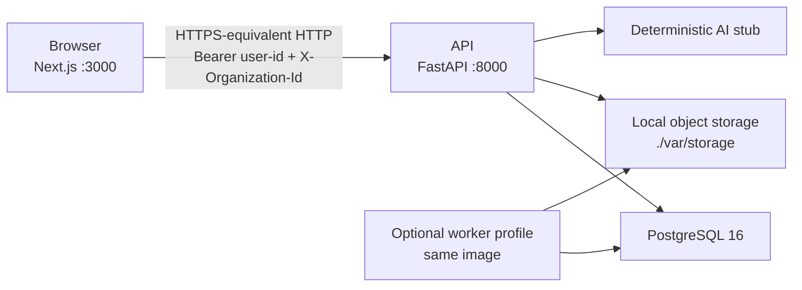
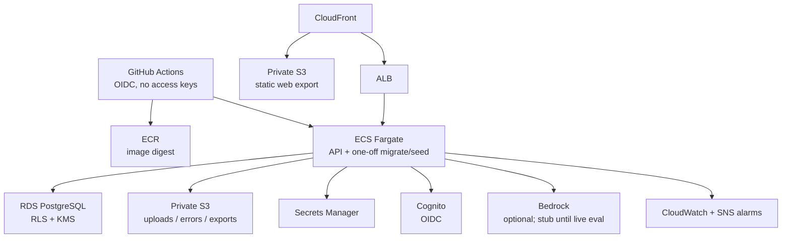

# Architecture

This page describes the running local product and the AWS layout encoded in Terraform. It does not claim that AWS is applied.

Financial totals are calculated in tested application code. The copilot only calls registered read tools. Domain modules do not import AWS SDKs.

## Local runtime

Compose starts PostgreSQL, the API (migrations on startup, no automatic seed), and the Next.js dev server. Object storage is a bind mount. There is no local AWS emulator. `AUTH_MODE=dev` is accepted only when `APP_ENV` is `local` or `test`.

## AWS layout (Terraform, not applied by default)

Modules under `infrastructure/terraform/modules` match this graph: `network`, `security`, `ecr`, `storage`, `identity`, `database`, `compute`, `edge`, `observability`, and `github_oidc`. Roots are `bootstrap/`, `environments/dev/`, and `environments/prod/`. State uses versioned, encrypted S3 with `use_lockfile = true`.

Development defaults stay small: one NAT Gateway, one API task (256 CPU / 512 MiB), `db.t4g.micro` single-AZ, 14-day logs, no WAF, `ai_provider = stub`. Production apply is never `terraform apply -auto-approve` without a plan file from the same job.

## Application shape

| Layer | Responsibility |
|---|---|
| `apps/web` | Static Next.js export. Formats decimal strings. Does not compute canonical money. |
| `apps/api` domain | Organizations, dimensions, money (`Decimal` / `numeric(19,4)`), variance, import rules, evidence hashes |
| Application / ports | Use cases and swappable storage, identity, and AI adapters |
| HTTP | FastAPI routes, idempotency, audit, health, operator metrics without financial rows |
| Workers | Same package and image: import jobs, watchdog, retention, seed, eval |

Tenant isolation is enforced in the use case and again with PostgreSQL row-level security. A forged `organization_id` returns `403` or `404` without saying whether the other tenant exists.

## Decisions that shape the system

| Decision | Choice |
|---|---|
| [ADR-001](DECISIONS.md#adr-001--modular-monolith) | One API deployable; workers reuse the same codebase |
| [ADR-002](DECISIONS.md#adr-002--deterministic-calculations-stay-outside-the-llm) | The model cannot write financial data or SQL |
| [ADR-003](DECISIONS.md#adr-003--decimal-money-and-json-strings) | Amounts are decimal strings, not JSON numbers |
| [ADR-004](DECISIONS.md#adr-004--nextjs-static-export-on-aws) | Static web on CloudFront; no required SSR |
| [ADR-006](DECISIONS.md#adr-006--postgresql-with-row-level-security) | Application auth plus RLS |
| [ADR-007](DECISIONS.md#adr-007--ports-for-storage-identity-and-ai) | Local adapters; no AWS SDK in the domain |
| [ADR-009](DECISIONS.md#adr-009--ci-assumes-aws-through-github-oidc) | CI uses OIDC, not permanent access keys |

Conversation persistence in `dev`/`prod` stays redacted until [ADR-012](DECISIONS.md#adr-012--conversation-persistence-policy) is accepted by a human.

## Traceability

[TRACEABILITY.md](TRACEABILITY.md) maps each requirement and acceptance criterion to tests, runbooks, and this tree. [RISKS.md](RISKS.md) lists residual risks. AWS apply, a public production URL, and tag `v1.0.0` stay behind the human gates in [GATES.md](GATES.md).
